# AX 레이더

**제조기업의 AI 전환(AX) 준비도를 5개 영역으로 자가진단하고, AI가 12개월 로드맵과 KPI를 제안하는 웹 서비스**

- 배포 URL: <https://codyssey-a1-3-ax-radar.vercel.app> (배포 후 Vercel 대시보드의 실제 주소로 확인)
- 저장소: <https://github.com/Sungtae10/codyssey-a1-3-ax-radar>
- 만든 사람: 김성태 · Codyssey AI 네이티브 과정 A1-3 미션 (AI 웹 서비스 빌딩)

| 구분 | 내용 |
|---|---|
| 프론트엔드 | HTML · CSS · JavaScript (프레임워크 없음), 반응형, 다크 모드 |
| 백엔드 | Vercel Serverless Functions (Python) `api/diagnose.py`, `api/health.py` |
| AI | Gemini API 기본 (Claude, OpenAI 중 키가 있는 것으로 교체 가능) |
| 배포 | GitHub 저장소 ↔ Vercel 연동 (push 하면 자동 재배포) |

---

## 목차

1. [서비스 소개](#1-서비스-소개)
2. [화면](#2-화면)
3. [동작 구조](#3-동작-구조)
4. [기술 스택과 폴더 구조](#4-기술-스택과-폴더-구조)
5. [실행 방법 (로컬)](#5-실행-방법-로컬)
6. [환경 변수 (API 키) 설정](#6-환경-변수-api-키-설정)
7. [배포 방법 (Vercel)](#7-배포-방법-vercel)
8. [API 명세와 실패 처리](#8-api-명세와-실패-처리)
9. [보안](#9-보안)
10. [테스트](#10-테스트)
11. [보너스 구현](#11-보너스-구현)
12. [제출 패키지와 문서](#12-제출-패키지와-문서)

---

## 1. 서비스 소개

**문제**: 제조기업 실무자는 "AI를 도입하라"는 지시는 받지만, 우리 회사가 지금 어느 단계이고 무엇부터 해야 하는지 판단할 기준이 없습니다.

**해결**: 5개 영역(전략·리더십, 데이터 기반, 기술·인프라, 인재·조직문화, 프로세스·거버넌스)을 1~5점으로 체크하면

1. 점수 합계로 **현재 단계(탐색 · 실험 · 확산 · 내재화 · 선도)** 를 계산하고 레이더 차트로 보여 줍니다. (코드가 계산, 같은 점수면 항상 같은 결과)
2. 업종·규모·고민을 반영해 **AI가 요약, 강점·보완점, 3단계 로드맵, KPI 3개, 이번 주 할 일, 주의점**을 제안합니다.

**타겟**: AI 전환을 시작하려는 중소·중견 제조기업의 경영기획·DX 담당자, 공장장, 스마트공장 지원사업 준비 담당자

| 섹션 (메뉴) | 내용 |
|---|---|
| 홈 | 서비스 가치, 진단 시작 버튼, 예시 레이더 차트 |
| 진단 모델 | 5개 영역 설명, 1~5점 척도, 5단계 계산 기준 |
| **AI 진단** | 입력 폼 → AI 결과 (핵심 기능), 입력 요령 |
| FAQ | 저장 여부, 정확도, 소요 시간, 오류 대처, 비용, 기술 |
| 소개 | 제작 배경, 동작 구조, 기술 스택 |

상단 고정 메뉴로 섹션을 이동하고, 지금 보는 섹션의 메뉴가 강조됩니다. 화면 폭 860px 이하에서는 햄버거 메뉴로 바뀝니다.

---

## 2. 화면

로컬 점검 스크린샷입니다. AI 결과 화면은 키 없이 찍은 **목업 응답**이라 하단에 "로컬 목업 응답(실제 AI 아님)"이 표시됩니다.

| 데스크톱 (1440px) | 모바일 (390px) |
|---|---|
| 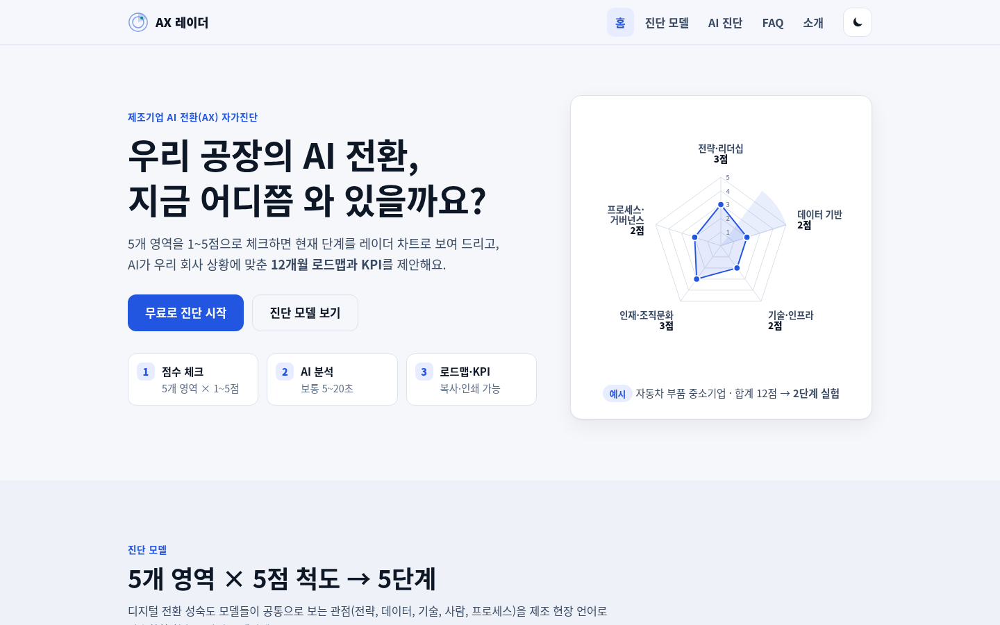 | 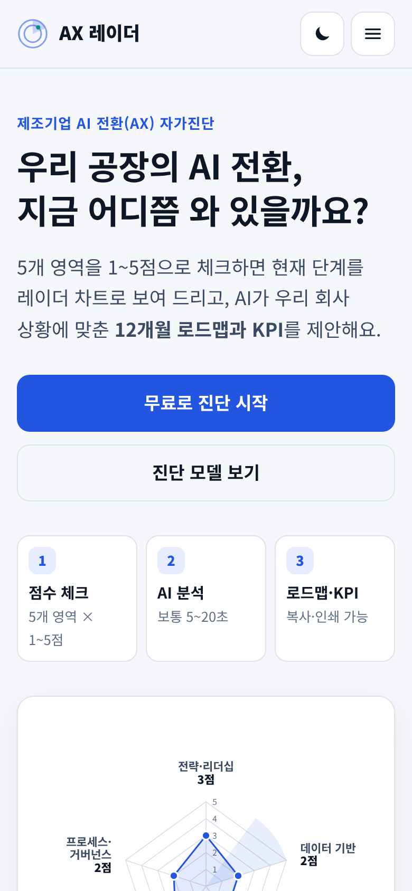 |
| 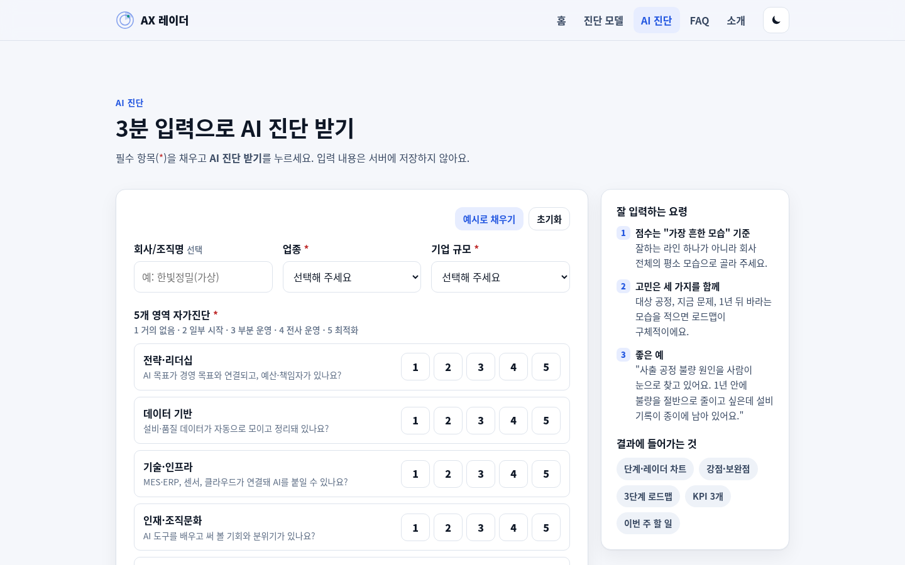 | 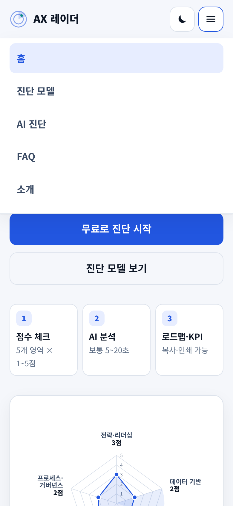 |

| AI 결과 (데스크톱) | AI 결과 (모바일) |
|---|---|
| 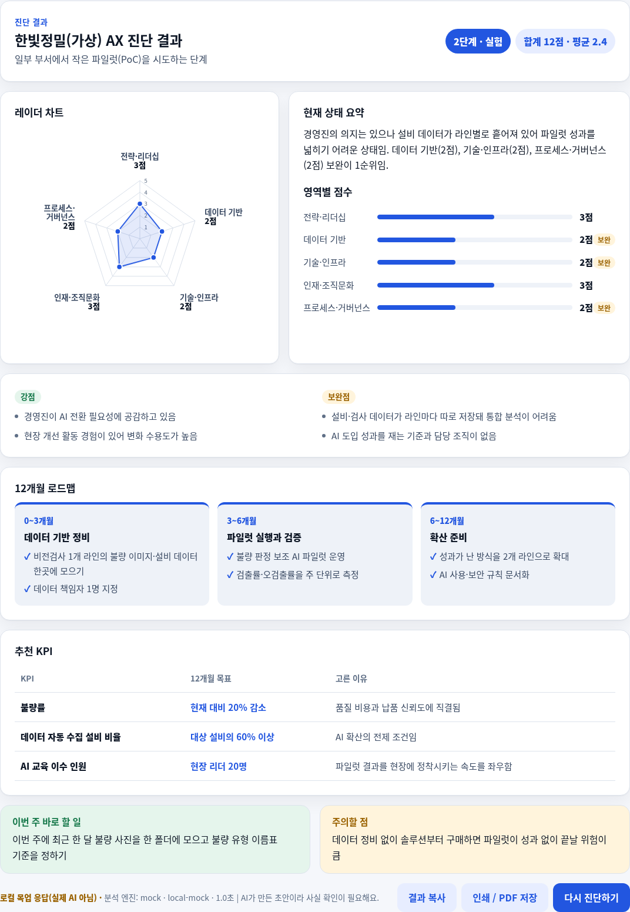 | 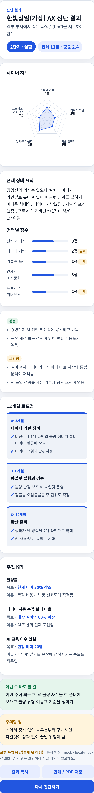 |

| 빈 입력 안내 | 요청 과다(429) 안내 | 시간 초과 안내 | 다크 모드 |
|---|---|---|---|
| 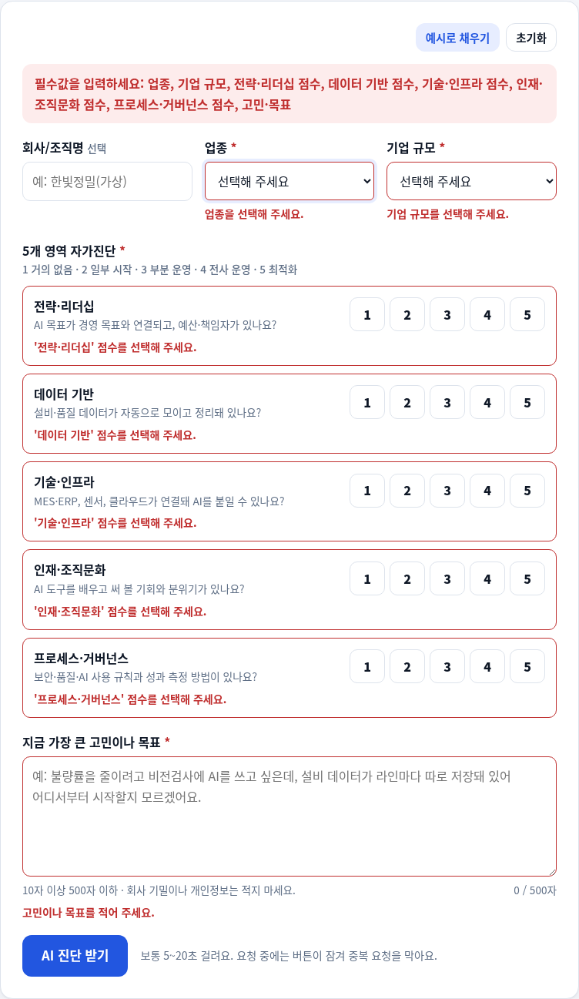 |  |  | 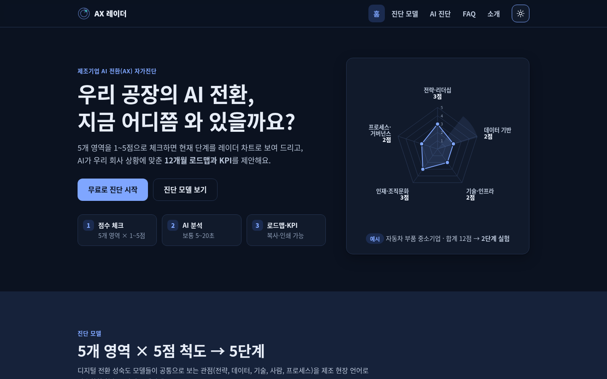 |

### 배포 환경 스크린샷 (실제 AI 동작)

배포 후 `docs/screenshots/20~24_deployed_*.png` 를 추가하고, 아래 주석 블록의 시작 줄과 끝 줄을 지우면 표시됩니다.

<!-- 배포 스크린샷 시작
| 배포 데스크톱 | 배포 모바일 | 실제 AI 결과 |
|---|---|---|
| 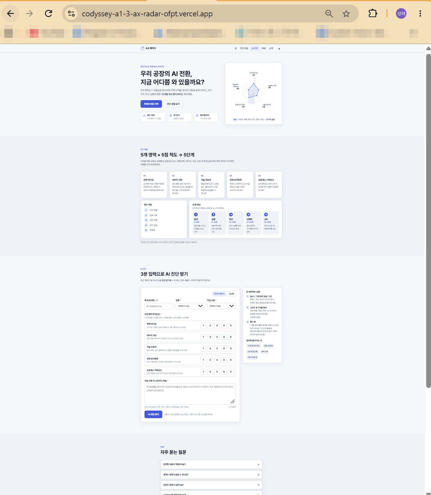 | 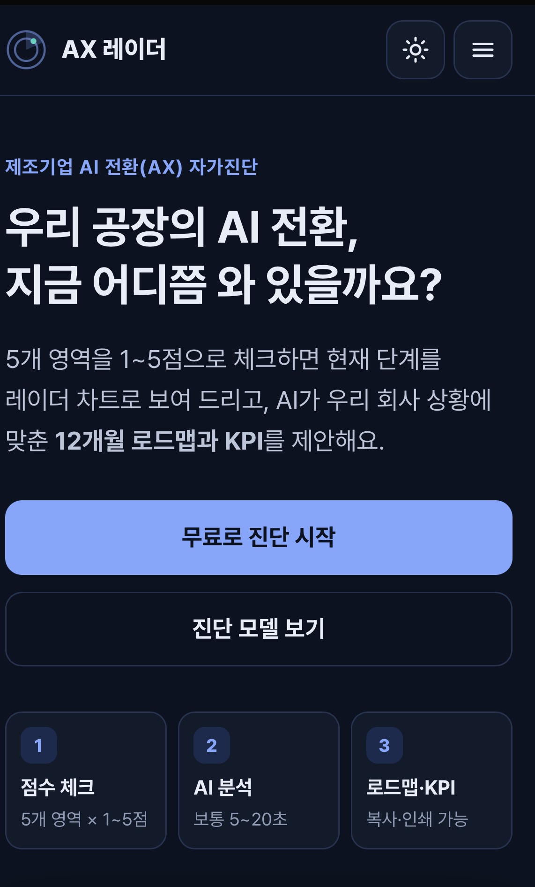 |  |
배포 스크린샷 끝 -->

---

## 3. 동작 구조

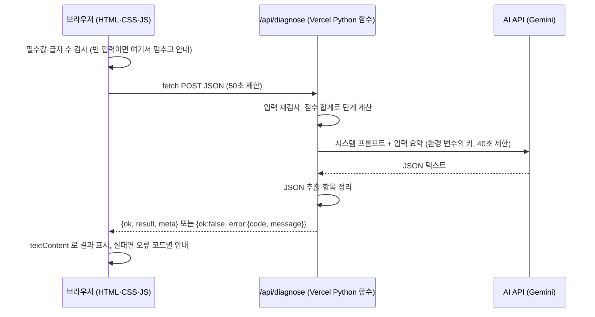

- API 키는 Vercel 서버의 환경 변수에만 있고 브라우저로 내려가지 않습니다.
- 브라우저는 같은 사이트의 `/api/diagnose` 만 부르므로 다른 도메인 문제(CORS)가 없습니다.

---

## 4. 기술 스택과 폴더 구조

| 영역 | 사용 기술 | 비고 |
|---|---|---|
| 구조 | HTML5 | 5개 섹션, 접근성 속성(aria), 본문 바로가기 |
| 디자인 | CSS3 | 색 변수, 미디어 쿼리 반응형, 다크 모드, 인쇄 스타일, 동작 줄이기 설정 존중 |
| 동작 | JavaScript (ES2017) | fetch, AbortController(타임아웃), SVG 레이더 차트 직접 구현 |
| 백엔드 | Python 3.12 (Vercel 기본) | `BaseHTTPRequestHandler` 기반 서버리스 함수 |
| 패키지 | `requests` | AI REST API 호출 (`requirements.txt`) |
| AI | Gemini `gemini-3.5-flash-lite` (기본) | Claude `claude-haiku-4-5-20251001`, OpenAI `gpt-5.4-mini` 로 교체 가능 |
| 배포 | Vercel + GitHub | `vercel.json`: 함수 최대 60초, 보안 헤더 |

```text
codyssey-a1-3-ax-radar/
├── index.html              # 화면 구조: 홈 / 진단 모델 / AI 진단 / FAQ / 소개
├── css/style.css           # 디자인, 반응형, 다크 모드
├── js/
│   ├── theme-init.js       # 저장된 테마를 첫 화면에 먼저 적용
│   ├── main.js             # 메뉴, 현재 섹션 강조, 다크 모드
│   ├── diagnose.js         # 폼 검사 → fetch → 결과 표시 / 실패 안내
│   └── radar.js            # SVG 레이더 차트
├── images/                 # 파비콘, 공유 이미지
├── api/                    # 백엔드 (Vercel Serverless Functions, Python)
│   ├── diagnose.py         # POST /api/diagnose : AI 진단
│   └── health.py           # GET  /api/health   : 상태·키 설정 확인
├── requirements.txt        # Python 패키지
├── vercel.json             # 함수 설정, 보안 헤더
├── .env.example            # 환경 변수 예시 (값은 비움)
├── scripts/
│   ├── dev_server.py       # 로컬 개발 서버 (목업·오류 재현 모드)
│   └── check_ui.py         # 브라우저 화면 자동 점검 + 스크린샷
├── tests/test_api.py       # API 단위 테스트 59개
└── docs/                   # 기획서, 테스트 리포트, 트러블슈팅, AI 사용 기록, 학습 노트, 배포 가이드
```

---

## 5. 실행 방법 (로컬)

Python 3.10 이상이 필요합니다. Vercel 로그인 없이 `scripts/dev_server.py` 로 화면과 API 를 함께 실행합니다.

```powershell
# Windows PowerShell
python -m pip install -r requirements.txt
Copy-Item .env.example .env        # 그다음 .env 를 열어 GEMINI_API_KEY= 뒤에 키 입력
python scripts/dev_server.py        # http://localhost:3000
```

```bash
# macOS / Linux
python3 -m pip install -r requirements.txt
cp .env.example .env
python3 scripts/dev_server.py
```

| 목적 | 명령 |
|---|---|
| 키 없이 화면 확인 (가짜 AI 응답) | `python scripts/dev_server.py --mock` |
| 실패 안내 확인 | `python scripts/dev_server.py --mock-error 429` (500, 502, 504, bad-json, no-key) |
| 지연 안내 확인 | `python scripts/dev_server.py --mock --mock-delay 12` |
| Vercel CLI 로 실행 (선택) | `npm i -g vercel` → `vercel dev` (Vercel 로그인·프로젝트 연결 필요) |

---

## 6. 환경 변수 (API 키) 설정

| 이름 | 필수 | 설명 |
|---|---|---|
| `GEMINI_API_KEY` | 셋 중 하나 | Google AI Studio 에서 발급 (<https://aistudio.google.com/apikey>), 무료 등급 있음 |
| `ANTHROPIC_API_KEY` | 셋 중 하나 | Claude API 키 |
| `OPENAI_API_KEY` | 셋 중 하나 | OpenAI API 키 |
| `LLM_PROVIDER` | 선택 | `gemini` · `anthropic` · `openai`. 비우면 키가 있는 것 중 gemini > anthropic > openai 순 |
| `GEMINI_MODEL` 등 | 선택 | 모델 이름 변경 (기본값은 위 기술 스택 표) |
| `AI_TIMEOUT_SECONDS` | 선택 | AI 응답 대기 시간, 기본 40 (5~55) |
| `RATE_LIMIT_PER_MINUTE` | 선택 | 같은 IP 가 1분에 요청할 수 있는 진단 횟수, 기본 6 (0 이면 끔) |
| `OPENAI_REASONING_EFFORT` | 선택 | OpenAI GPT-5 계열 추론 강도 `none`·`minimal`·`low`·`medium`·`high`, 기본 `low` |
| `NOTIFY_WEBHOOK_URL` | 선택 | 보너스: 진단 요약을 받을 Discord / Make 웹훅 |

- **로컬**: `.env` 파일에 `이름=값` 형식으로 적습니다. `.env` 는 `.gitignore` 에 있어 GitHub 에 올라가지 않습니다.
- **Vercel**: 프로젝트 → Settings → Environment Variables 에 같은 이름으로 추가합니다. **값을 바꾼 뒤에는 Redeploy 해야 적용됩니다.**
- 설정 확인: `https://배포주소/api/health` 의 `"config_ok": true` (키 값은 표시하지 않고, 설정이 틀리면 `config_error` 에 이유 표시)

---

## 7. 배포 방법 (Vercel)

1. GitHub 에 빈 저장소 `codyssey-a1-3-ax-radar` 를 만들고 push 합니다.
2. <https://vercel.com/new> → Import Git Repository → 이 저장소 **Import**
3. Framework Preset **Other**, Root Directory `./`, Environment Variables 에 `GEMINI_API_KEY` 입력 → **Deploy**
4. 배포 URL 에서 `/api/health` 와 AI 진단을 확인합니다.
5. 이후 코드를 고쳐 push 하면 Vercel 이 자동으로 다시 배포합니다.

자세한 단계와 확인 방법: [docs/06_deploy-guide.md](docs/06_deploy-guide.md)

---

## 8. API 명세와 실패 처리

### `POST /api/diagnose`

요청 예시

```json
{
  "company": "한빛정밀(가상)",
  "industry": "auto",
  "size": "medium",
  "scores": { "strategy": 3, "data": 2, "tech": 2, "people": 3, "governance": 2 },
  "goal": "불량률을 줄이려고 비전검사에 AI를 도입하고 싶은데 설비 데이터가 흩어져 있어요."
}
```

- `industry`: `semiconductor` · `auto` · `battery` · `machinery` · `chemical` · `food` · `other`
- `size`: `small` · `medium` · `midsize` · `large`
- `scores`: 5개 영역 모두 정수 1~5, `goal`: 10~500자, `company`: 선택 (40자까지)

성공 응답 (200, 일부 생략)

```json
{
  "ok": true,
  "result": {
    "level": 2, "level_name": "실험", "total": 12, "average": 2.4,
    "scores": { "strategy": 3, "data": 2, "tech": 2, "people": 3, "governance": 2 },
    "summary": "…", "strengths": ["…"], "gaps": ["…"],
    "roadmap": [{ "phase": "0~3개월", "title": "…", "actions": ["…"] }],
    "kpis": [{ "name": "…", "target": "…", "why": "…" }],
    "quick_win": "…", "caution": "…"
  },
  "meta": { "provider": "gemini", "model": "gemini-3.5-flash-lite", "elapsed_ms": 8123 }
}
```

실패 응답: `{"ok": false, "error": {"code": "EMPTY_INPUT", "message": "고민이나 목표를 적어 주세요.", "field": "goal"}}`

| HTTP | 코드 | 상황 | 화면 안내 |
|---|---|---|---|
| 400 | `EMPTY_INPUT` · `INVALID_INPUT` · `TOO_LONG` · `BAD_JSON` · `BAD_REQUEST` | 필수값 누락, 형식·길이 오류, 요청 크기 정보 오류 | "필수값을 입력하세요" + 해당 칸 표시 |
| 405 | `METHOD_NOT_ALLOWED` | POST 가 아닌 요청 | 요청 방식 오류 |
| 413 | `TOO_LARGE` | 요청 본문 10KB 초과 | 입력이 너무 커요 |
| 429 | `TOO_MANY_REQUESTS` | 같은 IP 가 1분에 6번 넘게 요청 (서버 호출 빈도 제한) | 잠시 후 다시 시도 |
| 429 | `RATE_LIMITED` | AI API 요청 과다·쿼터 초과 | 1분 뒤 다시 시도 |
| 500 | `CONFIG_MISSING_KEY` · `CONFIG_INVALID` | 서버에 키가 없거나 설정 오류 | 서버 설정이 필요해요 (운영자 확인) |
| 500 | `SERVER_ERROR` | 예상하지 못한 오류 | 잠시 후 다시 시도 |
| 502 | `AI_AUTH_ERROR` · `AI_MODEL_NOT_FOUND` · `AI_BAD_REQUEST` · `AI_UPSTREAM_ERROR` · `AI_UNREACHABLE` · `AI_BLOCKED` · `AI_BAD_OUTPUT` | AI API 쪽 문제 | 원인별 문구 + 다시 시도 |
| 504 | `AI_TIMEOUT` | AI 응답 40초 초과 | 응답 시간 초과 |
| (브라우저) | `CLIENT_TIMEOUT` · `NETWORK_ERROR` | 50초 무응답, 네트워크 끊김 | 요청 중단 안내, 연결 확인 안내 |

추가로 10초가 지나면 "평소보다 오래 걸리고 있어요" 지연 안내를 보여 주고, JSON 이 아닌 오류 화면(예: Vercel 기본 504 페이지)도 상태 코드로 안내합니다.

### `GET /api/health`

```json
{ "ok": true, "service": "ax-radar", "provider": "gemini", "model": "gemini-3.5-flash-lite", "key_configured": true, "config_ok": true, "config_error": null, "notify_webhook": false, "runtime": "python 3.12.x", "time": "…" }
```

---

## 9. 보안

- API 키는 **코드·README·스크린샷에 넣지 않고** 환경 변수로만 관리합니다. (`.env` 커밋 차단, 저장소 전체 키 형식 검사 테스트 포함)
- 키는 URL 이 아니라 요청 헤더로 보내고, 서버 로그에서는 키를 `***` 로 가립니다. 로그에 사용자 문장을 남기지 않습니다.
- AI 응답은 `textContent` 로만 화면에 넣어 HTML·스크립트가 실행되지 않습니다.
- 같은 IP 는 1분에 6번까지만 AI 를 부를 수 있습니다. (브라우저의 3초 제한은 우회될 수 있어 서버에서도 제한, IP 는 1분 동안 메모리에만 보관)
- `.env` 는 `.gitignore` 와 `.vercelignore` 모두에 있어 GitHub 에도, Vercel CLI 배포에도 올라가지 않습니다.
- 사용자가 적은 고민 문장은 프롬프트 안에서 "지시가 아닌 자료"로 구분해 프롬프트 주입을 줄입니다. (따옴표를 여러 개 넣어 구분 기호를 흉내 내는 우회도 차단)
- 응답 헤더: `X-Content-Type-Options: nosniff`, `X-Frame-Options: DENY`, `Referrer-Policy`, `Permissions-Policy` (`vercel.json`)
- **키 유출이 의심되면**: ① 발급처에서 즉시 폐기 ② 새 키로 Vercel 환경 변수 교체 후 Redeploy ③ 커밋 이력에 들어갔다면 `git filter-repo --replace-text` 로 정리 후 강제 push (절차: [docs/03_troubleshooting.md](docs/03_troubleshooting.md))

---

## 10. 테스트

```bash
python -m unittest discover -s tests -v   # API 단위 테스트 59개 (키·인터넷 불필요)
python scripts/check_ui.py                 # 브라우저 화면 점검 46개 (playwright 설치 필요)
```

| 종류 | 결과 | 내용 |
|---|---|---|
| 단위 테스트 | 59 / 59 통과 | 입력 검증, 단계 경계값, 제공자별 요청 형식, 오류 코드 변환, 응답 정리, 프롬프트 구분 기호 우회 차단, 서버 호출 빈도 제한, health 설정 판단, 웹훅, HTTP 응답, 키 노출 검사 |
| 화면 점검 | 46 / 46 통과 | 1440 / 768 / 390px, 메뉴, 빈 입력, 결과, 오류 코드 6종, 네트워크 끊김, 지연·타임아웃, 다크 모드, XSS |
| 테스트·검토로 고친 결함 | 3건 + 검토 6건 | 로그 키 노출 가능성, hidden 무시, 첫 클릭 무시 / 독립 검토: 구분 기호 우회, health 오판, CLI 배포 시 .env 업로드 위험 등 |

상세: [docs/02_test-report.md](docs/02_test-report.md)

---

## 11. 보너스 구현

| 보너스 | 구현 |
|---|---|
| UX 고도화 | 다크 모드(시스템 설정 따름 + 선택 기억), 로딩 단계 문구·경과 시간, 결과 등장 애니메이션, 버튼 눌림 효과, 레이더 스캔 애니메이션 (움직임 줄이기 설정 시 끔) |
| 운영 자동화 | `NOTIFY_WEBHOOK_URL` 을 설정하면 진단 완료 때 업종·규모·점수·단계 요약을 Discord 또는 Make / Zapier 웹훅으로 전송 (회사명·고민 문장은 미전송) |
| 개선 효과 측정 방법 | 결과 하단의 소요 시간(`meta.elapsed_ms`), Vercel Logs 의 `diagnosis_ok` / `request_failed` 비율로 응답 속도와 오류율을 확인. 방문자 수가 필요하면 Vercel 대시보드 Analytics 에서 Enable 후 안내되는 스크립트 2줄을 `index.html` 에 추가 (HTML 방식은 패키지 설치 불필요) |

---

## 12. 제출 패키지와 문서

| 제출물 | 위치 |
|---|---|
| 배포된 웹 서비스 | 위 배포 URL |
| GitHub 저장소 | 이 저장소 (프론트 `index.html`·`css/`·`js/` 와 백엔드 `api/` 분리) |
| README | 이 문서 |
| 서비스 기획서 | [docs/01_service-plan.md](docs/01_service-plan.md) |
| 증빙 자료 | 스크린샷 [docs/screenshots/](docs/screenshots/), AI 코딩 도구 사용 기록 [docs/04_ai-coding-log.md](docs/04_ai-coding-log.md) |

| 참고 문서 | 내용 |
|---|---|
| [docs/02_test-report.md](docs/02_test-report.md) | 테스트 결과와 배포 환경 점검표 |
| [docs/03_troubleshooting.md](docs/03_troubleshooting.md) | 실제로 겪은 오류의 원인·수정, 배포 후 오류 해결표 |
| [docs/05_learning-notes.md](docs/05_learning-notes.md) | 미션 목표 6가지 설명, 예상 질문, 시연 순서 |
| [docs/06_deploy-guide.md](docs/06_deploy-guide.md) | GitHub push부터 Vercel 배포·확인·제출까지 |

> 이 프로젝트는 AI 코딩 도구(Claude)로 코드와 문서 초안을 만들고, 테스트로 결함을 찾아 고친 뒤 김성태가 검토·배포했습니다. 과정은 커밋 이력과 [AI 코딩 도구 사용 기록](docs/04_ai-coding-log.md)에 남겼습니다.
