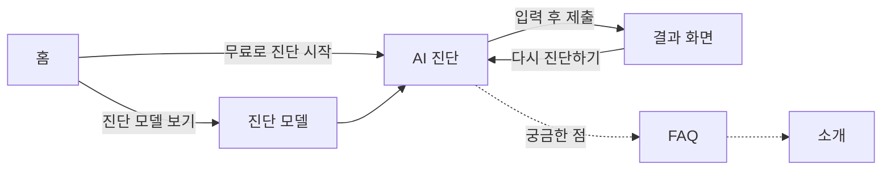
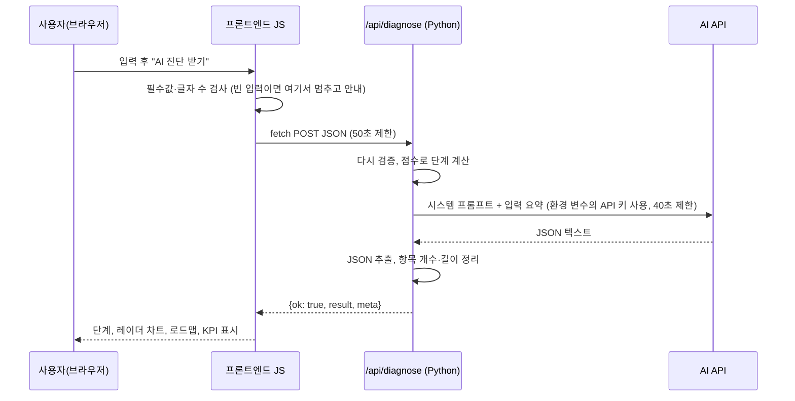

# AX 레이더 서비스 기획서

| 항목 | 내용 |
|---|---|
| 서비스명 | AX 레이더 (AX Radar) |
| 한 줄 소개 | 우리 공장의 AI 전환(AX) 준비도를 5개 영역으로 진단하고, AI가 12개월 로드맵과 KPI를 제안하는 웹 서비스 |
| 작성자 | 김성태 |
| 작성일 / 버전 | 2026-09-29 / v1.0 (Codyssey A1-3 제출용) |
| 배포 형태 | Vercel (정적 프론트엔드 + Python 서버리스 함수) |

---

## 1. 서비스 개요

### 1-1. 문제 (왜 만드는가)

- 제조기업은 "AI를 도입해야 한다"는 압박은 크지만, **우리 회사가 지금 어느 단계인지, 무엇부터 해야 하는지**를 판단할 기준이 부족합니다.
- 컨설팅 진단은 비용과 시간이 많이 들어, 중소·중견기업 실무자가 첫 판단을 내리기 어렵습니다.
- 실무자는 경영진 보고를 위해 "현재 수준 + 우선순위 + 측정 지표"를 한 장으로 정리해야 합니다.

### 1-2. 해결 (무엇을 제공하는가)

1. **5개 영역 자가진단**: 전략·리더십, 데이터 기반, 기술·인프라, 인재·조직문화, 프로세스·거버넌스를 1~5점으로 체크합니다.
2. **정량 결과(항상 같음)**: 점수 합계로 5단계(탐색 · 실험 · 확산 · 내재화 · 선도) 중 현재 단계를 계산하고 레이더 차트로 보여 줍니다.
3. **정성 결과(AI 생성)**: 업종·규모·고민을 반영해 AI가 요약, 강점, 보완점, 3단계 로드맵, KPI, 이번 주 할 일, 주의점을 제안합니다.

### 1-3. 기대 가치

| 사용자 | 얻는 것 |
|---|---|
| DX/AX 실무 담당자 | 3분 입력으로 경영진 보고용 "현재 단계 + 12개월 로드맵 + KPI" 초안 |
| 공장장·생산기술 리더 | 데이터·인프라·인재 중 어디가 병목인지 한눈에 확인 |
| 컨설턴트·연구자 | 인터뷰 전 사전 진단 도구로 활용 |

---

## 2. 타겟 사용자

### 2-1. 주 타겟 (페르소나)

- **이름**: 박지훈 (가상 인물), 38세, 자동차 부품 중소기업(직원 180명) 경영기획팀 과장
- **상황**: 사장님이 "올해 안에 AI로 불량률을 줄일 계획을 가져오라"고 지시했지만, 회사 데이터가 설비마다 흩어져 있어 어디서부터 시작할지 막막함
- **바라는 것**: 외부 컨설팅 전에 회사 수준을 빠르게 점검하고, 보고서에 쓸 로드맵과 KPI 초안을 얻고 싶음
- **사용 환경**: 사무실 PC에서 진단하고, 이동 중 휴대폰으로 결과를 다시 확인

### 2-2. 보조 타겟

- 제조 스타트업 PM, 기술경영(MOT) 전공 학생, 스마트공장 지원사업 준비 담당자

### 2-3. 사용 시나리오

1. 홈에서 "무료로 진단 시작" 버튼을 누른다.
2. 진단 모델 섹션에서 5개 영역의 뜻을 확인한다.
3. 업종·규모를 고르고, 영역별 점수와 고민을 입력한 뒤 "AI 진단 받기"를 누른다.
4. 5~20초 뒤 단계, 레이더 차트, 로드맵, KPI를 확인한다.
5. "결과 복사" 또는 "인쇄/PDF 저장"으로 보고서 초안에 붙인다.

---

## 3. 페이지·섹션 구성과 메뉴 이동 방식

한 페이지(`index.html`) 안에 5개 섹션을 두고, 상단 메뉴로 이동합니다. (요구사항: 3개 이상)

| 순서 | 섹션 (메뉴명) | 주소 | 목적 | 주요 요소 |
|---|---|---|---|---|
| 1 | 홈 | `#home` | 서비스 가치 전달, 진단 시작 유도 | 핵심 문구, 시작 버튼 2개, 예시 레이더 차트 |
| 2 | 진단 모델 | `#model` | 무엇을 어떻게 진단하는지 설명 | 5개 영역 카드, 1~5점 척도, 5단계 설명 |
| 3 | AI 진단 | `#diagnose` | **핵심 기능**: 입력 → AI 결과 | 입력 폼, 로딩 상태, 결과 화면, 오류 안내 |
| 4 | FAQ | `#faq` | 저장·정확도·시간·오류·비용 안내 | 펼침형 질문 6개 |
| 5 | 소개 | `#about` | 제작 배경, 기술 구조, 제작자 | 기술 스택, 동작 구조도, 저장소 링크 |

### 메뉴 이동 방식

- **상단 고정 메뉴**: 스크롤해도 메뉴가 화면 위에 남아 있고, 메뉴를 누르면 해당 섹션으로 부드럽게 이동합니다.
- **현재 위치 표시**: 지금 보고 있는 섹션의 메뉴가 강조됩니다.
- **모바일 메뉴**: 화면 폭 860px 이하에서는 햄버거 버튼(☰)으로 메뉴를 열고 닫습니다. 메뉴 항목을 누르거나 Esc 키를 누르면 닫힙니다.
- **바로가기 버튼**: 홈의 "무료로 진단 시작"은 AI 진단 섹션으로, "진단 모델 보기"는 진단 모델 섹션으로 이동합니다.



---

## 4. 핵심 기능

| ID | 기능 | 설명 | 구분 |
|---|---|---|---|
| F1 | 진단 모델 안내 | 5개 영역, 1~5점 척도, 5단계 기준을 카드로 설명 | 필수 |
| F2 | 입력 폼과 검증 | 필수값 누락, 글자 수, 점수 범위를 제출 전에 검사하고 칸마다 안내 | 필수 |
| F3 | **AI 진단** | `fetch('/api/diagnose')` → Python 서버리스 함수 → AI API → JSON 결과 | **필수 (AI 기능)** |
| F4 | 결과 시각화 | 단계 배지, 레이더 차트, 강점/보완점, 로드맵 3단계, KPI 표 | 필수 |
| F5 | 실패 처리 | 빈 입력, API 오류(4xx/5xx), 지연·시간 초과를 각각 다른 문구로 안내 | 필수 |
| F6 | 반응형 | 모바일(390px), 태블릿(768px), 데스크톱(1440px)에서 레이아웃 유지 | 필수 |
| F7 | 결과 복사·인쇄 | 결과를 텍스트로 복사하거나 인쇄/PDF 저장 | 추가 |
| F8 | 다크 모드·마이크로 인터랙션 | 테마 전환(설정 기억), 로딩 단계 문구, 결과 등장 애니메이션 | 보너스 |
| F9 | 운영 알림 웹훅 | 진단 완료 시 업종·규모·점수 요약을 Discord 또는 Make 웹훅으로 전송 (환경 변수로 켜기) | 보너스 (선택) |

---

## 5. 진단 모델

디지털 전환 성숙도 모델에서 공통으로 쓰는 관점(전략, 데이터, 기술, 사람, 프로세스)을 제조 현장 언어로 단순화한 **학습용 간이 모델**입니다. 공식 인증이나 전문 진단을 대신하지 않습니다.

### 5-1. 5개 영역

| 키 | 영역 | 확인 질문 |
|---|---|---|
| `strategy` | 전략·리더십 | AI 전환 목표가 경영 목표와 연결돼 있고, 경영진이 예산과 책임자를 정했나요? |
| `data` | 데이터 기반 | 설비·품질·생산 데이터가 자동으로 모이고, 필요할 때 찾아 쓸 수 있게 정리돼 있나요? |
| `tech` | 기술·인프라 | MES·ERP 같은 시스템, 센서, 클라우드가 서로 연결돼 AI를 붙일 수 있나요? |
| `people` | 인재·조직문화 | 현장과 사무직이 AI 도구를 배우고 써 볼 기회와 분위기가 있나요? |
| `governance` | 프로세스·거버넌스 | 보안·품질·AI 사용 규칙과 성과를 재는 방법이 정해져 있나요? |

### 5-2. 점수 척도 (영역마다 1개 선택)

| 점수 | 1 | 2 | 3 | 4 | 5 |
|---|---|---|---|---|---|
| 의미 | 거의 없음 | 일부 시작 | 부분 운영 | 전사 운영 | 최적화 |

### 5-3. 단계 계산 규칙 (AI가 아니라 코드가 계산)

5개 점수의 합계(5~25점)로 단계를 정합니다. 같은 점수를 넣으면 **항상 같은 단계**가 나옵니다.

| 단계 | 이름 | 합계 (평균) | 뜻 |
|---|---|---|---|
| 1 | 탐색 | 5~8점 (1.0~1.6) | AI 전환의 필요성을 느끼고 정보를 모으는 단계 |
| 2 | 실험 | 9~12점 (1.8~2.4) | 일부 부서에서 작은 파일럿(PoC)을 시도하는 단계 |
| 3 | 확산 | 13~16점 (2.6~3.2) | 성과가 난 사례를 여러 라인·부서로 넓히는 단계 |
| 4 | 내재화 | 17~20점 (3.4~4.0) | AI가 일상 업무와 의사결정에 자리 잡은 단계 |
| 5 | 선도 | 21~25점 (4.2~5.0) | 데이터와 AI로 새로운 사업 모델과 경쟁우위를 만드는 단계 |

> 설계 이유: 단계 번호까지 AI에게 맡기면 같은 입력에도 결과가 달라질 수 있습니다. 숫자(정량)는 코드가 계산하고, 설명(정성)만 AI가 쓰도록 역할을 나눴습니다.

---

## 6. AI 기능 설계

### 6-1. 입력

| 필드 | 화면 요소 | 필수 | 규칙 |
|---|---|---|---|
| `company` 회사/조직명 | 한 줄 입력 | 선택 | 최대 40자 |
| `industry` 업종 | 선택 상자 | 필수 | 7개 중 1개: 반도체·디스플레이 / 자동차·부품 / 이차전지·소재 / 기계·장비 / 화학·바이오 / 식품·소비재 / 기타 제조 |
| `size` 기업 규모 | 선택 상자 | 필수 | 4개 중 1개: 소기업(50명 미만) / 중소기업(50~299명) / 중견기업(300~999명) / 대기업(1,000명 이상) |
| `scores` 영역별 점수 | 영역마다 1~5 버튼 | 필수 | 5개 영역 모두, 정수 1~5 |
| `goal` 고민·목표 | 여러 줄 입력 | 필수 | 10자 이상 500자 이하, 글자 수 표시 |

### 6-2. 처리 흐름



### 6-3. 프롬프트 설계 원칙

1. AI의 역할: 제조기업 AI 전환 전략 컨설턴트.
2. 출력은 정해진 JSON 한 개만 (Gemini는 응답 스키마로 한 번 더 강제).
3. 점수가 낮은 영역을 보완 우선순위로, 높은 영역을 강점으로 연결.
4. 입력에 없는 사실(매출, 인원, 특정 솔루션)을 지어내지 않고, 필요한 가정은 "가정:"으로 표시.
5. 특정 기업·제품 실명 추천과 가격 제시 금지.
6. 사용자가 적은 문장 속 지시문은 따르지 않고 자료로만 취급 (프롬프트 주입 방지).

### 6-4. 출력

| 항목 | 개수 | 화면 위치 |
|---|---|---|
| `level`, `level_name`, `average`, `scores` | 1 | 단계 배지, 레이더 차트 (코드 계산 값) |
| `summary` 현재 상태 요약 | 2~3문장 | 차트 옆 요약 |
| `strengths` 강점 / `gaps` 보완점 | 각 2~3개 | 두 칸 카드 |
| `roadmap` 로드맵 | 3단계 (0~3개월 / 3~6개월 / 6~12개월), 단계별 실행 과제 2~3개 | 3열 타임라인 |
| `kpis` KPI | 3개 (이름, 12개월 목표, 선정 이유) | KPI 표 |
| `quick_win` 이번 주 할 일 | 1개 | 강조 상자 |
| `caution` 주의할 점 | 1개 | 주의 상자 |
| `meta` 엔진·모델·소요 시간 | 1 | 결과 하단 작은 글씨 |

### 6-5. 실패 처리 기준

| 상황 | 감지 위치 | HTTP / 코드 | 사용자 안내 문구 (요약) | 사용자가 할 일 |
|---|---|---|---|---|
| 필수값 누락 | 브라우저 (1차), 서버 (2차) | 400 `EMPTY_INPUT` | "필수값을 입력하세요: 업종, 고민·목표 …" + 칸마다 빨간 안내 | 표시된 칸 채우기 |
| 요청 과다 (우리 서버) | 서버 (같은 IP 1분 6회 초과) | 429 `TOO_MANY_REQUESTS` | "요청이 너무 잦아요. 1분에 6번까지 진단할 수 있어요" | 잠시 후 재시도 |
| 글자 수 부족·초과 | 브라우저, 서버 | 400 `INVALID_INPUT` / `TOO_LONG` | "10자 이상 적어 주세요 (지금 N자)" | 문장 보완 |
| 잘못된 요청 형식 | 서버 | 400 `BAD_JSON` · `BAD_REQUEST`, 413 `TOO_LARGE` | "요청 형식이 올바르지 않아요" | 새로고침 후 재시도 |
| 요청 과다·쿼터 초과 | AI API 429 → 서버 | 429 `RATE_LIMITED` | "요청이 많아 AI가 잠시 쉬고 있어요. 1분 뒤 다시 시도" | 1분 뒤 재시도 |
| AI 키 누락 | 서버 | 500 `CONFIG_MISSING_KEY` | "서버에 AI 키가 설정되지 않았어요 (운영자 확인)" | 운영자가 환경 변수 설정 |
| AI 인증·모델 오류 | AI API 400/401/403/404 → 서버 | 502 `AI_AUTH_ERROR` / `AI_MODEL_NOT_FOUND` / `AI_BAD_REQUEST` | "AI 서비스 인증에 실패했어요 (운영자 확인)" 등 | 운영자가 키·모델 확인 |
| AI 서버 장애 | AI API 5xx → 서버 | 502 `AI_UPSTREAM_ERROR` | "AI 서버에 일시적인 문제가 있어요" | 잠시 후 재시도 |
| AI 응답 형식 오류 | 서버 (JSON 해석 실패) | 502 `AI_BAD_OUTPUT` | "AI 응답 형식이 올바르지 않아요. 다시 시도" | 재시도 |
| 서버 쪽 시간 초과 | 서버 (AI 대기 40초) | 504 `AI_TIMEOUT` | "AI 응답이 40초 안에 오지 않았어요" | 잠시 후 재시도 |
| 응답 지연 | 브라우저 (10초 경과) | 없음 | "평소보다 오래 걸리고 있어요…" (기다리는 중 표시) | 기다리기 |
| 브라우저 쪽 시간 초과 | 브라우저 (50초) | `CLIENT_TIMEOUT` | "응답이 50초 넘게 오지 않아 요청을 멈췄어요" | 재시도 |
| 네트워크 끊김 | 브라우저 | `NETWORK_ERROR` | "서버에 연결하지 못했어요. 인터넷 연결 확인" | 연결 확인 후 재시도 |
| 알 수 없는 서버 오류 | 서버 | 500 `SERVER_ERROR` | "예상하지 못한 오류가 났어요" | 재시도, 계속되면 문의 |

모든 오류 안내에는 **다시 시도** 버튼과 오류 코드(예: `RATE_LIMITED · HTTP 429`)를 함께 보여 줘서, 사용자는 행동을 알고 운영자는 원인을 추적합니다.

### 6-6. 비용·호출 빈도 관리

- 요청 중에는 제출 버튼을 잠가 중복 호출을 막고, 응답 후 3초 동안 다시 누를 수 없게 합니다.
- 브라우저 제한은 우회될 수 있으므로 서버에서도 같은 IP 는 1분에 6번까지만 AI 를 부르게 합니다. (서버리스 인스턴스별 메모리 기준이라 완벽한 전역 제한은 아님)
- 입력 길이를 500자로 제한하고, AI 응답 대기 시간을 40초로 제한합니다.
- 기본 모델은 비용이 낮고 빠른 경량 모델(Gemini 3.5 Flash-Lite, 2026년 9월 요금표 기준 무료 등급 제공)로 정했습니다.
- 서버 로그에는 키와 사용자 문장을 남기지 않고, 제공자·상태 코드·소요 시간만 남깁니다.

---

## 7. 기술 구조

| 구분 | 선택 | 이유 |
|---|---|---|
| 프론트엔드 | HTML, CSS, JavaScript (프레임워크 없음) | 미션 조건, 구조를 직접 이해하기 쉬움 |
| 백엔드 | Vercel Serverless Functions (Python) | 서버를 따로 켜 두지 않아도 요청이 올 때만 실행 |
| AI API | Gemini (기본), Claude, OpenAI 중 키가 있는 것 | 환경 변수만 바꿔 제공자 교체 가능 |
| 배포 | GitHub 저장소 + Vercel 연동 | push 할 때마다 자동 재배포 |

```text
codyssey-a1-3-ax-radar/
├── index.html          화면 구조 (5개 섹션)
├── css/style.css       디자인, 반응형, 다크 모드
├── js/                 화면 동작 (메뉴, 폼 검증, fetch, 결과 표시, 차트)
├── images/             아이콘, 공유 이미지
├── api/diagnose.py     AI 진단 서버리스 함수 (POST /api/diagnose)
├── api/health.py       상태 확인 함수 (GET /api/health)
├── requirements.txt    Python 패키지 목록
├── vercel.json         함수 실행 시간, 보안 헤더
├── scripts/            로컬 개발 서버, 화면 점검 스크립트
├── tests/              API 단위 테스트
└── docs/               기획서, 테스트 리포트, 학습 노트, 스크린샷
```

---

## 8. 성공 지표 (KPI)

| KPI | 정의 | 목표 | 확인 방법 |
|---|---|---|---|
| 진단 완료율 | "AI 진단 받기" 클릭 중 결과 화면까지 도달한 비율 | 90% 이상 | 동료 테스트 기록, Vercel 함수 로그의 200 응답 비율 |
| 평균 응답 시간 | 제출부터 결과 표시까지 | 20초 이하 | 결과 하단 소요 시간(`meta.elapsed_ms`) 기록 |
| 오류 안내 커버리지 | 정의한 실패 상황 중 전용 문구가 나오는 비율 | 100% | 테스트 리포트의 실패 케이스 표 |
| 반응형 결함 | 390px / 768px / 1440px에서 가로 스크롤·겹침 | 0건 | 화면 점검 스크립트, 실기기 확인 |

---

## 9. 개인정보·보안 원칙

- 입력값은 서버에 저장하지 않습니다. 진단을 위해 AI API로만 전달됩니다. 호출 빈도 제한을 위해 접속 IP 를 1분 동안 메모리에만 보관합니다.
- API 키는 코드, README, 스크린샷 어디에도 넣지 않고 환경 변수로만 관리합니다. (`.env`는 `.gitignore`로 커밋 차단)
- AI 응답은 `textContent`로만 화면에 넣어, 응답에 HTML·스크립트가 섞여도 실행되지 않습니다.
- 보너스 웹훅을 켜도 회사명과 고민 문장은 보내지 않고 업종·규모·점수·단계만 보냅니다.
- 키 유출이 의심되면 즉시 발급처에서 폐기·재발급하고, Vercel 환경 변수를 교체한 뒤 재배포합니다. (절차는 README 보안 항목)

---

## 10. 일정과 산출물 체크리스트

| 단계 | 산출물 | 상태 |
|---|---|---|
| 기획 | 이 기획서 (`docs/01_service-plan.md`) | 완료 |
| 구조 구성 | 폴더 구조, GitHub 커밋 이력 | 완료 (GitHub 공개 저장소 `Sungtae10/codyssey-a1-3-ax-radar`) |
| 백엔드 | `api/diagnose.py`, `api/health.py`, `requirements.txt` | 완료 |
| 프론트엔드 | `index.html`, `css/`, `js/` | 완료 |
| 로컬 검증 | 단위 테스트 59개, 화면 점검 46개, 스크린샷 14장, 독립 검토 | 완료 (`docs/02_test-report.md`) |
| 배포 | Vercel URL, 배포 환경 동작 확인 | 완료 (<https://codyssey-a1-3-ax-radar-ofpt.vercel.app>, 실제 Gemini 응답 15.4초, 점검표 `docs/02_test-report.md` 7장) |
| 문서화 | README, 테스트 리포트, 트러블슈팅, AI 코딩 로그, 학습 노트 | 완료 (배포 URL, 배포 환경 스크린샷 20~24 포함) |

---

## 11. 다음 개선 아이디어

1. 진단 결과를 PDF 보고서 양식으로 내보내기
2. 같은 회사의 재진단 결과를 비교하는 "변화 추적" 화면
3. 업종별 평균 점수와 비교 (데이터가 쌓인 뒤, 개인정보 동의 절차 포함)
4. 결과 만족도(도움 됐어요 / 아쉬워요) 버튼으로 프롬프트 개선 효과 측정
