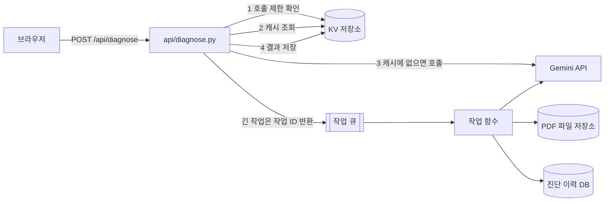

# 개선·확장 계획 (응답 지연·비용, 백엔드 확장, 프레임워크 전환)

지금 구조(바닐라 화면 + Python 서버리스 함수 + Gemini)를 유지하면서 다음 단계로 무엇을 어떻게 바꿀지 정리한 설계 메모입니다.
1장은 **이미 적용한 것**과 **다음 후보**를 나눠 적었고, 2장과 3장은 아직 적용하지 않은 확장 설계입니다.

| 장 | 다루는 질문 |
|---|---|
| 1 | AI 응답이 느리거나 비용이 늘면 무엇으로 줄이나? (캐싱, 비동기 처리, 경량 모델, 출력 상한) |
| 2 | 기능이 늘면 백엔드에 무엇을 붙이나? (KV 저장소, 작업 큐, DB, 파일 저장소) |
| 3 | React/Vue 같은 프레임워크를 쓸 수 있다면 무엇이 좋아지고, 어디까지 바꿔야 하나? |

---

## 1. 응답 지연·비용 개선

### 1-1. 지금 적용한 것

| 항목 | 현재 값 | 효과 |
|---|---|---|
| 경량 모델 기본값 | `gemini-3.5-flash-lite` (환경 변수 `GEMINI_MODEL` 로 교체) | 빠르고 저렴, 무료 등급으로 누구나 재현 |
| 입력 길이 제한 | 고민 10~500자, 회사명 40자, 요청 본문 10KB | 입력 토큰(비용·지연)의 상한 |
| 출력 구조 고정 | JSON 스키마, 로드맵 3단계·KPI 3개로 제한 | 출력 길이 상한, 파싱 실패 감소 |
| 단계 계산은 코드가 | 점수 합계로 1~5단계를 계산 (AI 호출 없음) | 즉시 계산, 같은 점수면 항상 같은 단계 |
| 시간 제한 | 연결 5초, AI 응답 40초, 브라우저 50초, 함수 최대 60초 | 늦어져도 정리된 오류(504)로 끝나고 화면이 멈추지 않음 |
| 지연 안내 | 10초가 지나면 지연 안내 문구 표시 | 기다리는 사람의 불안 감소 (체감 지연 완화) |
| 호출 빈도 제한 | 요청 중 버튼 잠금, 응답 뒤 3초 대기, 같은 IP 1분 6회 | 연타·남용으로 인한 비용·쿼터 소모 방지 |
| 측정 | 서버 로그 `diagnosis_ok` 의 `elapsed_ms`, 결과 하단 소요 시간 | 배포 환경 실측 1회 15.4초 (`docs/02_test-report.md` P6) |

### 1-2. 다음 후보 (우선순위 순)

| 순위 | 방안 | 어떻게 | 기대 효과 | 비용·위험 | 필요한 것 |
|---|---|---|---|---|---|
| 1 | **응답 캐싱** | 업종·규모·점수·고민(공백 정리)을 합쳐 SHA-256 해시를 만들고, 그 해시를 키로 AI 결과 JSON 을 24시간 보관. 같은 입력이면 AI 를 부르지 않고 바로 반환 | 같은 입력은 1초 안에 응답, AI 호출 비용 0. 시연·평가 때 많이 쓰는 "예시로 채우기" 입력에 특히 효과 | 입력 원문 대신 해시만 키로 저장. 결과에 회사명이 들어가므로 보관 기간을 짧게. 결과 하단에 "저장된 결과" 여부 표시 | KV 저장소 (2장) |
| 2 | **출력 토큰 상한** | Gemini `generationConfig.maxOutputTokens` 지정, 항목별 글자 수 상한을 프롬프트에 명시 | 긴 응답으로 인한 지연·비용의 상한 | 너무 낮으면 JSON 이 잘려 `AI_BAD_OUTPUT` 이 늘어남 → 실측 후 결정 | 코드 수정 + 단위 테스트 |
| 3 | **스트리밍 응답** | `streamGenerateContent` 로 받아 요약부터 먼저 화면에 표시 | 첫 글자가 보이기까지의 시간 단축 (체감 지연 감소) | 완성 전 JSON 을 조금씩 그리는 로직 필요, 오류 처리 복잡 | 화면 렌더링 수정 |
| 4 | **비동기 처리 (작업 큐)** | POST 는 작업 ID 만 바로 돌려주고(HTTP 202), 백그라운드 작업이 AI 호출 후 결과 저장, 화면은 2~3초 간격으로 결과 조회 | 함수 시간 제한과 무관, PDF 보고서·일괄 진단 같은 긴 작업에 적합 | 구조가 복잡해져 대화형 1건 진단에는 과함 | 작업 큐 + KV (2장) |
| 5 | **일괄(배치) 처리** | 여러 회사 진단을 모아 AI 공급사의 배치 API 로 한 번에 처리 | 즉시 응답이 필요 없는 대량 작업의 단가 절감 (공급사 요금표 확인 후 적용) | 결과가 몇 분~몇 시간 뒤에 나옴 | 작업 큐 |
| 6 | **모델 선택과 대체** | 평소 경량 모델, 오류·지연이 반복되면 다른 제공자로 재시도 (지금도 환경 변수로 제공자 교체 가능) | 가용성·속도 확보 | 제공자마다 문장 스타일 차이, 관리할 키 증가 | 환경 변수, 재시도 로직 |

### 1-3. 효과 측정 (KPI)

| KPI | 목표 (제안) | 측정 방법 |
|---|---|---|
| 응답 시간 p95 | 20초 이하 | Vercel 런타임 로그 `diagnosis_ok` 의 `elapsed_ms` 집계 |
| 캐시 적중률 | 시연·평가 기간 30% 이상 | 캐시 적중·미적중 로그 비율 |
| 진단 1건당 AI 호출 수 | 1회 이하 | AI 호출 수 ÷ 진단 요청 수 |
| 실패율 | 5% 이하 | `request_failed` 로그를 오류 코드별로 집계 |

---

## 2. 백엔드 확장 설계

### 2-1. 지금 구조의 한계

- 서버리스 함수는 요청마다 따로 실행돼 메모리를 공유하지 않습니다. 그래서 IP 호출 제한이 **인스턴스별로만** 동작합니다. (`docs/03_troubleshooting.md` R3)
- 저장소가 없어 결과 공유 링크, 재진단 비교, 캐시를 만들 수 없습니다.
- AI 호출이 한 요청 안에서 끝나야 해서(최대 60초) PDF 보고서나 일괄 진단 같은 긴 작업에 맞지 않습니다.

### 2-2. 추가할 컴포넌트

| 컴포넌트 | 예시 | 쓰임 | 저장 데이터 | 보관 기간 |
|---|---|---|---|---|
| KV 저장소 (Redis 계열) | Upstash Redis 등 (Vercel Marketplace 연동) | 응답 캐시, 전역 호출 제한 카운터, 결과 공유 링크 | 입력 해시 → 결과 JSON, IP 해시 → 요청 수 | 캐시 24시간, 호출 제한 1분 |
| 작업 큐 | 관리형 메시지 큐 또는 Redis 기반 큐 | 비동기 진단, PDF 생성, 웹훅 알림 재시도 | 작업 ID, 상태, 결과 위치 | 완료 후 7일 |
| 관계형 DB | Postgres (Vercel Marketplace 연동) | 동의한 사용자의 진단 이력, 재진단 비교, 업종별 평균 | 점수, 단계, 업종·규모 (고민 원문은 동의한 경우만) | 삭제 요청 시 즉시 삭제 |
| 파일 저장소 | Vercel Blob 등 | PDF 보고서 파일 | PDF | 30일 |
| 관측 도구 | 로그 드레인, 지표 대시보드 | 응답 시간·실패율·비용 추적 | 로그 (키·사용자 문장 제외) | 운영 정책에 따름 |

### 2-3. 확장 후 흐름

### 2-4. 도입 순서와 원칙

1. KV 1개로 **응답 캐시 + 전역 호출 제한** (바뀌는 곳: `api/diagnose.py` 의 `check_rate_limit`, `run_diagnosis` 앞뒤)
2. KV 에 짧은 ID 로 결과를 저장해 **결과 공유 링크**
3. 작업 큐 + 파일 저장소로 **PDF 보고서**
4. 동의 기반 DB 저장으로 **재진단 비교·업종별 평균** (`docs/01_service-plan.md` 11장 아이디어)

- API 응답 형식(`{ok, result, meta}` / `{ok:false, error}`)은 그대로 유지해 화면 코드 변경을 최소화합니다.
- 새 서비스의 접속 정보도 모두 Vercel 환경 변수로만 관리합니다.
- 개인정보는 최소로 저장하고, 원문 대신 해시를 우선 사용합니다.

---

## 3. 프레임워크(React/Vue) 도입 시 장단점과 전환 범위

> 이번 미션은 "순수 HTML/CSS/JavaScript" 가 조건이라 적용하지 않았습니다. 프레임워크가 허용되는 경우를 가정한 검토입니다.

### 3-1. 장단점

| 구분 | 장점 | 단점 |
|---|---|---|
| 개발 | 점수 입력 5개, 결과 카드처럼 반복되는 화면을 컴포넌트로 재사용 | 빌드 도구(npm, Vite) 설치·설정 필요 |
| 상태 관리 | 입력·로딩·오류·결과 상태를 선언적으로 관리해 화면 표시 실수 감소 (D2 처럼 숨김 처리가 어긋나는 문제 예방) | 상태 관리 방식을 새로 익혀야 함 |
| 보안 | JSX·템플릿이 기본으로 문자열을 이스케이프 (지금은 `textContent` 로 직접 관리) | 의존 패키지가 늘어 보안 업데이트 관리 필요 |
| 성능 | 화면이 커질수록 필요한 부분만 다시 그려 효율적 | 번들 크기가 늘어 첫 로딩이 느려질 수 있음 (지금은 빌드 없이 CSS 1개, JS 4개) |
| 협업·테스트 | 컴포넌트 단위 테스트 도구, TypeScript 와 결합이 쉬움 | 한 페이지·폼 1개 규모에는 구조가 과할 수 있음 |
| 배포 | Vercel 이 Vite·Next.js 프리셋을 지원 | Application Preset, 출력 폴더(`dist`) 설정 변경, Python 함수와 함께 배포되는지 확인 필요 |

- Next.js 로 가면 API 도 JavaScript 로 옮기는 선택지가 생기지만, 이번 미션의 "Python 서버리스 함수" 조건과 맞지 않아 후보에서 뺐습니다.

### 3-2. 파일별 전환 범위 (React + Vite 기준)

| 지금 파일 | 줄 수 | 전환 후 | 작업 |
|---|---|---|---|
| `index.html` | 479 | 뼈대 `index.html` + 컴포넌트 7개 (Header, Hero, ModelSection, DiagnoseForm, ResultView, Faq, About) | 마크업을 JSX 로 옮김 |
| `js/diagnose.js` | 535 | `useDiagnosis` 훅 + DiagnoseForm·ResultView | 검증·fetch·오류 안내 로직을 옮기고 DOM 직접 조작 코드 제거 |
| `js/radar.js` | 134 | RadarChart 컴포넌트 | 좌표 계산은 그대로, 그리기만 JSX 로 |
| `js/main.js` | 115 | `useTheme`, `useScrollSpy` 훅 + Header | 테마·메뉴·스크롤 강조 옮김 |
| `js/theme-init.js` | 11 | `index.html` 의 인라인 스크립트로 유지 | 첫 화면 깜빡임 방지는 그대로 |
| `css/style.css` | 794 | 그대로 import (필요하면 CSS Modules 로 분리) | 거의 없음 |
| `api/*.py` | 841 | **변경 없음** | `fetch('/api/diagnose')` 요청·응답 형식 유지 |
| `tests/test_api.py` | 59개 테스트 | 그대로 | 없음 |
| `scripts/check_ui.py` | 46개 점검 | 요소 id 를 유지하면 대부분 재사용 | 선택자 확인 |
| `vercel.json` | | 프리셋 Vite, 출력 `dist`, `functions` 설정 유지 | 설정 수정 |

정리하면 화면 코드 약 1,270줄(HTML 479 + JS 795)을 옮기고, 서버 코드 841줄과 API 테스트 59개는 그대로 둡니다. 프론트와 백엔드가 `fetch('/api/...')` 계약으로만 연결돼 있어서 가능한 범위입니다.

### 3-3. 판단 기준과 전환 순서

- **바닐라 유지가 맞는 경우 (지금)**: 한 페이지, 입력 폼 1개, 결과 화면 1개. 빌드 없이 배포가 단순하고 첫 로딩이 빠릅니다.
- **도입을 검토할 시점**: 로그인·진단 이력·비교 화면처럼 화면 상태가 여러 개로 늘 때, 여러 사람이 동시에 화면을 개발할 때
- **전환 순서**
  1. API 형식 고정 (README 8장에 이미 정리)
  2. 결과 화면(ResultView)부터 컴포넌트로 옮김
  3. 화면 점검 스크립트(`scripts/check_ui.py`)로 이전과 같게 동작하는지 확인
  4. 나머지 섹션 이전
  5. Vercel 프리셋을 바꾸고 미리보기(Preview) 배포에서 확인한 뒤 운영 배포
